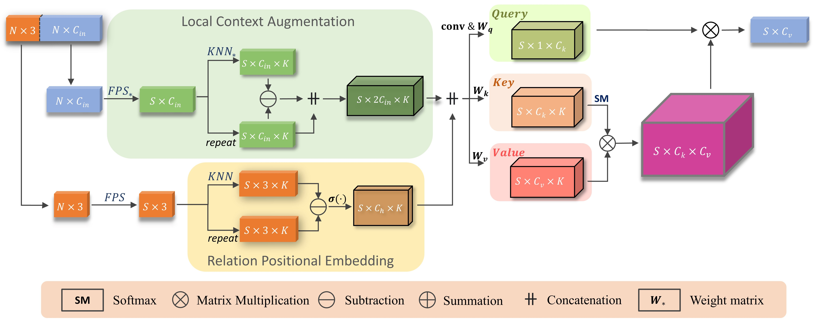

# 3DMedPT

<!-- **\[our code for IntrA and Modelnet40 classification is released]**

3D Medical Point Transformer: Introducing Convolution to Attention Networks for Medical Point Cloud Analysis

[](https://paperswithcode.com/sota/classification-on-intra?p=3d-medical-point-transformer-introducing)
[](https://paperswithcode.com/sota/3d-part-segmentation-on-intra?p=3d-medical-point-transformer-introducing)

[[arxiv]](https://arxiv.org/pdf/2112.04863.pdf) [[project page]](https://3dmedpt.github.io/)

Author: Jianhui Yu, Chaoyi Zhang, Heng Wang, Dingxin Zhang, Yang Song, Tiange Xiang, Dongnan Liu, Weidong Cai -->

<!-- ## Model Architecture

 -->

## Requirements

* Python 3.7
* Pytorch 1.6
* CUDA 10.0
* Packages: tqdm, sklearn, visualdl, einops, natsort
* To build the CUDA kernel for FPS:
    ```
    pip install pointnet2_ops_lib/.  
    ```
  <b>NOTE:</b> If you encounter problems while building the kernel, you can refer to [Pointnet2_PyTorch](https://github.com/erikwijmans/Pointnet2_PyTorch) for solutions.

## Data
The IntrA dataset can be downloaded from [intra3d2019](https://github.com/intra3d2019/IntrA), and you need to unzip the files to ```data/IntrA3D```.

The ModelNet40 dataset is automatically downloaded.

## Performance

* State-of-the-art accuracy on IntrA classification: <b>0.936</b> (F1 score)
* State-of-the-art accuracy on IntrA segmentation: 
  * IoU: <b>94.82%</b> on healthy vessel and <b>82.39%</b> on aneurysm
  * DSC: <b>97.29%</b> on healthy vessel and <b>89.71%</b> on aneurysm
* ModelNet40 classification: <b>93.4%</b>
* ShapeNet40 part segmentation: <b>84.3%</b> (class mIoU)

## Training Command

* For IntrA model train (1024 points)
  ```
  CUDA_VISIBLE_DEVICES=xx python main_intra.py --exp_name intra_cls_train --mode train --num_points 1024 --lr 0.01 --use_sgd True --num_K 32 64
  ```

* For ModelNet40 model train (1024 points)
  ```
  CUDA_VISIBLE_DEVICES=xx python main_m40.py --exp_name m40_cls_train --mode train --num_points 1024 --epochs 250 --lr 0.001 --num_K 20 20
  ```
<b>NOTE:</b> To achieve a fast computational speed, you can also uncomment ```torch.backends.cudnn.benchmark = True``` and comment out ```torch.backends.cudnn.deterministic = True```, while the final results might vary.

<!-- ## Citation

If you find our data or project useful in your research, please cite:

```
@article{yu20213d,
  title={3D Medical Point Transformer: Introducing Convolution to Attention Networks for Medical Point Cloud Analysis},
  author={Yu, Jianhui and Zhang, Chaoyi and Wang, Heng and Zhang, Dingxin and Song, Yang and Xiang, Tiange and Liu, Dongnan and Cai, Weidong},
  journal={arXiv preprint arXiv:2112.04863},
  year={2021}
}
``` -->

### Acknowledgement

Our code borrows from:

* [lambda-networks](https://github.com/lucidrains/lambda-networks)
* [Pointnet_Pointnet2_pytorch](https://github.com/yanx27/Pointnet_Pointnet2_pytorch)
* [dgcnn.pytorch](https://github.com/AnTao97/dgcnn.pytorch)
